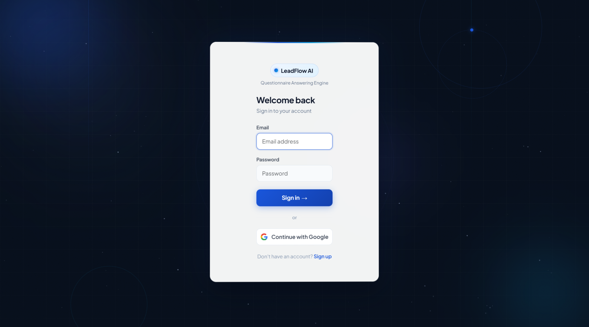
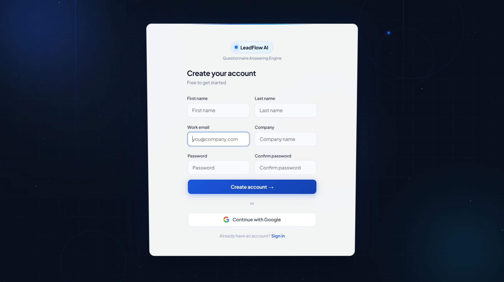
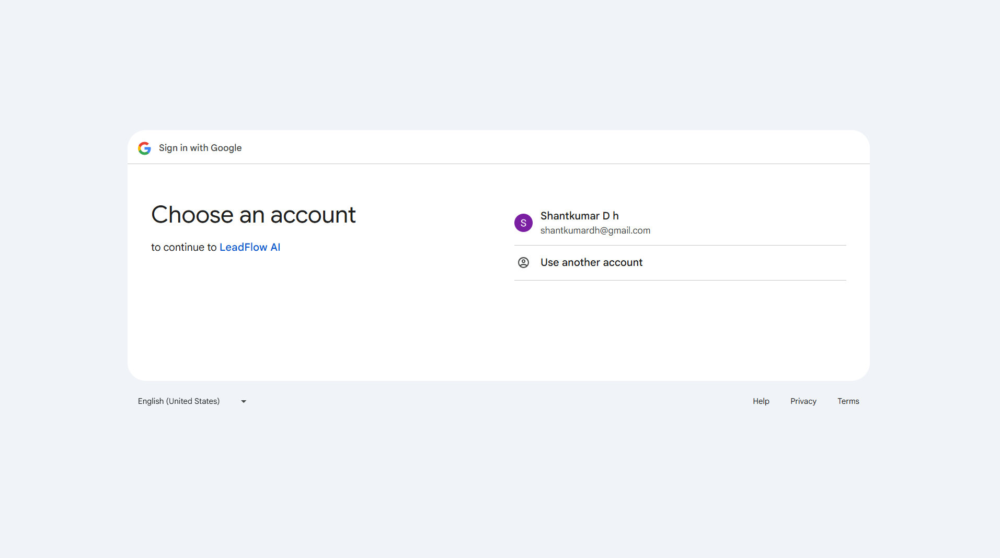
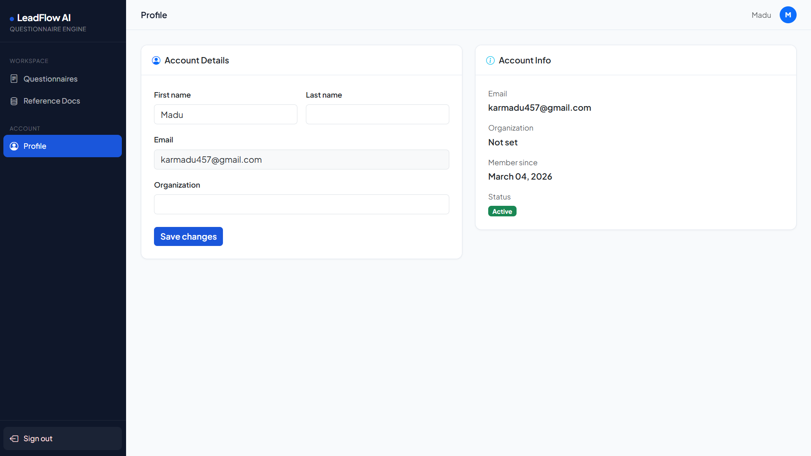
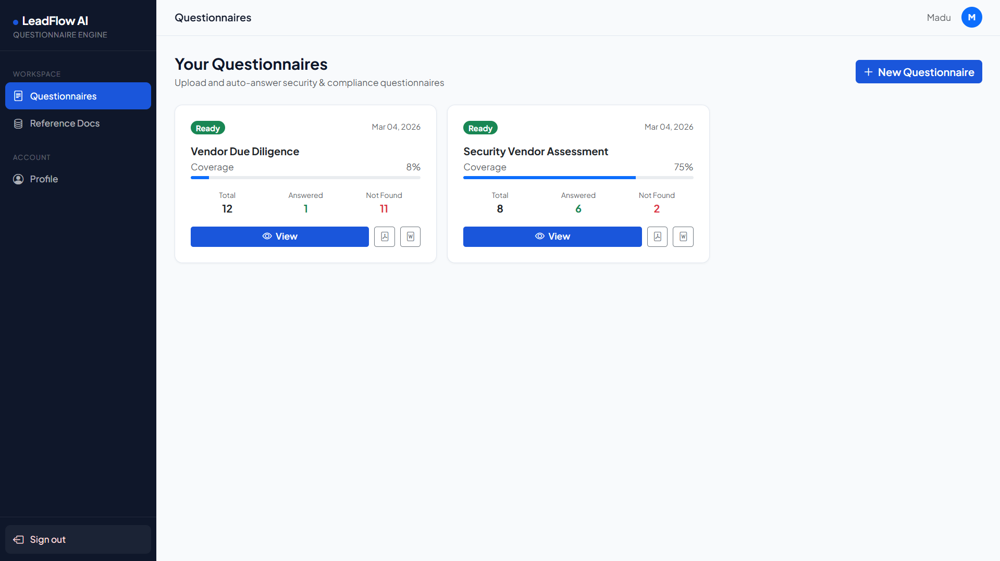
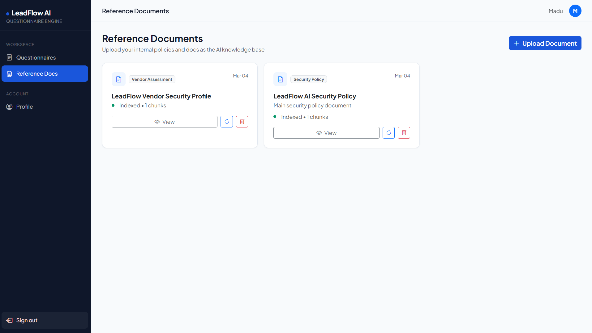
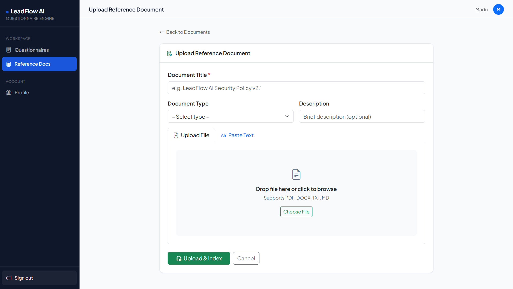
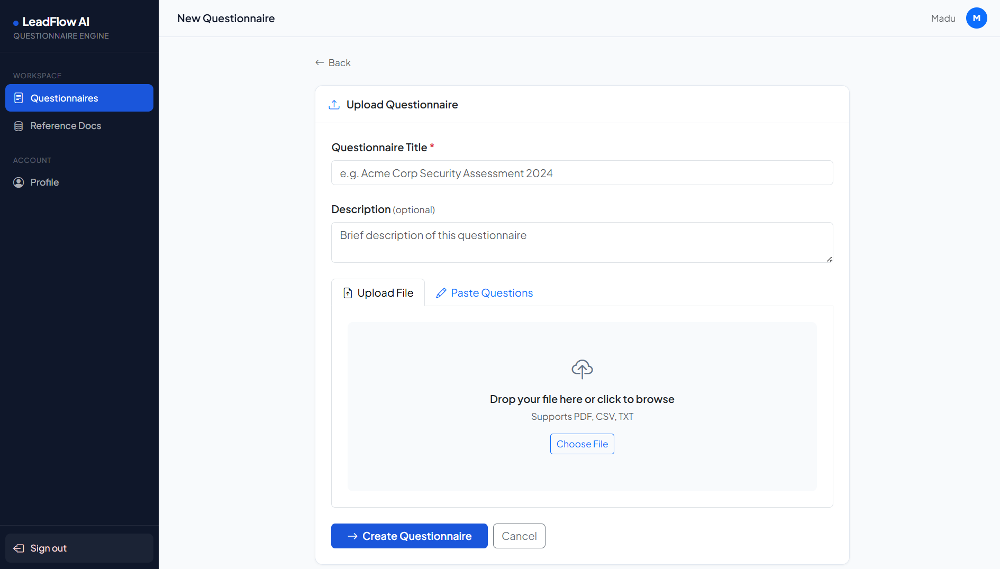
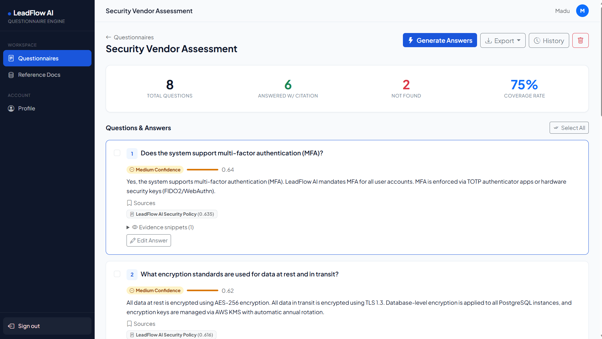
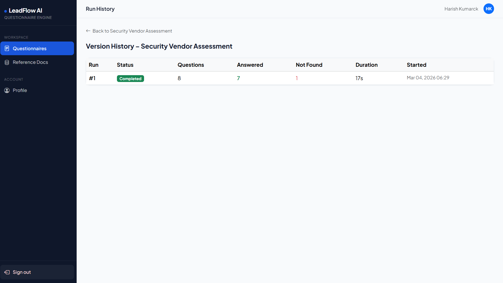

<div align="center">

# 🤖 LeadFlow AI — Structured Questionnaire Answering Tool

[](https://python.org)
[](https://djangoproject.com)
[](https://aistudio.google.com)
[](https://supabase.com)
[](https://render.com)

**An AI-powered RAG system that automatically answers enterprise questionnaires using your internal reference documents — with citations, confidence scores, and version history.**

[Live Demo](https://leadflowai-d391.onrender.com) · [GitHub Repo](https://github.com/Kowshik-bh18/leadflow-rag) · [Setup Guide](SETUP_GUIDE.md)

</div>

---

## 📌 Industry & Fictional Company

**Industry:** B2B SaaS / CRM

**Company:** LeadFlow AI is a fictional B2B SaaS CRM platform that helps sales teams automate lead tracking, pipeline management, and customer engagement. With 500+ enterprise customers, LeadFlow regularly receives security questionnaires, vendor assessments, and compliance audits from procurement teams — which this tool automates.

---

## 🎯 What I Built

A full-stack web application where users can:

1. **Sign up / Log in** — email/password or Google OAuth
2. **Upload reference documents** — PDF, DOCX, TXT (internal policies, security docs)
3. **Upload a questionnaire** — PDF, CSV, TXT or paste questions manually
4. **Generate answers** — AI retrieves relevant chunks from reference docs and generates grounded answers with citations
5. **Review and edit answers** — inline editing before export
6. **Export** — download as PDF or DOCX preserving original structure

### All 5 Nice-to-Have Features Implemented

- ✅ Confidence Score per answer
- ✅ Evidence Snippets (expandable)
- ✅ Partial Regeneration (checkbox select)
- ✅ Version History (full run tracking)
- ✅ Coverage Summary (top of questionnaire)

---

## 🖥️ Application Screenshots

### 1. Login Page


_Clean login UI with email/password and Google OAuth support_

### 2. Sign Up Page


_User registration with first name, last name, work email, company, and password_

### 3. Google OAuth


_One-click Google sign-in — redirects to Google account chooser_

### 4. Profile Page



_Manage user account details including first name, last name, email, and organization. Also displays API access and refresh tokens for programmatic access to the platform._

### 5. Questionnaires Dashboard


_Overview of all questionnaires with coverage rate, answered count, and not-found count_

### 6. Reference Documents


_Manage your knowledge base — upload and index reference documents_

### 7. Upload Reference Document


_Upload PDF/DOCX/TXT or paste text directly — auto-indexed with pgvector embeddings_

### 8. New Questionnaire


_Upload questionnaire file (PDF/CSV/TXT) or paste questions manually_

### 9. Run History



_Version history showing each generation run with stats and duration_

---

## 🏗️ System Architecture

```
┌─────────────────────────────────────────────────────────────────┐
│                        USER BROWSER                             │
│              Django Templates + Bootstrap 5                     │
└──────────────────────────┬──────────────────────────────────────┘
                           │ HTTP
┌──────────────────────────▼──────────────────────────────────────┐
│                     DJANGO APPLICATION                          │
│                                                                 │
│  ┌─────────────┐  ┌──────────────┐  ┌─────────────────────┐   │
│  │    Auth     │  │Questionnaires│  │  Reference Docs     │   │
│  │  (allauth)  │  │   (views)    │  │    (upload/index)   │   │
│  └─────────────┘  └──────┬───────┘  └──────────┬──────────┘   │
│                          │                      │               │
│  ┌───────────────────────▼──────────────────────▼───────────┐  │
│  │                    RAG ENGINE                             │  │
│  │                                                          │  │
│  │  chunker.py → embeddings.py → retriever.py → generator  │  │
│  │  (500w chunks) (Gemini embed) (pgvector cos) (Gemini LLM)│  │
│  └───────────────────────────────────────────────────────────┘  │
│                                                                 │
│  ┌─────────────────┐              ┌──────────────────────────┐  │
│  │   Export Engine │              │     REST API (DRF)       │  │
│  │  PDF + DOCX     │              │  Session Auth, polling   │  │
│  └─────────────────┘              └──────────────────────────┘  │
└──────────────────────────┬──────────────────────────────────────┘
                           │
┌──────────────────────────▼──────────────────────────────────────┐
│                    SUPABASE POSTGRESQL                          │
│                                                                 │
│  users  questionnaires  questions  answers  runs               │
│  reference_documents  document_chunks (vector[768])            │
│                                                                 │
│              pgvector HNSW index (cosine similarity)           │
└─────────────────────────────────────────────────────────────────┘
```

---

## 🔄 RAG Pipeline Flow

```
INDEXING FLOW
─────────────
Document Upload
      │
      ▼
Extract Text (PDF/DOCX/TXT)
      │
      ▼
Chunk Text (500 words, 50 overlap)
      │
      ▼
Gemini Embed (text-embedding-004, 768-dim)
      │
      ▼
Store in pgvector (Supabase)


ANSWER GENERATION FLOW
──────────────────────
User clicks "Generate Answers"
      │
      ▼
For each Question:
      │
      ├─ Embed question (Gemini, task_type=retrieval_query)
      │
      ├─ pgvector cosine similarity search (top-5 chunks)
      │
      ├─ Filter by confidence threshold (≥ 0.35)
      │
      ├─ If no chunks → "Not found in references."
      │
      └─ Generate answer (Gemini 1.5 Flash)
             │
             ▼
      Save Answer + Citations + Evidence + Confidence Score
             │
             ▼
      Update Run statistics
```

---

## 🛠️ Tech Stack

| Layer         | Technology                     | Reason                              |
| ------------- | ------------------------------ | ----------------------------------- |
| Backend       | Django 4.2                     | Batteries-included, fast to ship    |
| Database      | PostgreSQL + pgvector          | Single DB for both data and vectors |
| Vector Search | pgvector (cosine)              | No external vector DB needed        |
| AI Embeddings | Gemini text-embedding-004      | Free tier, 768-dim, high quality    |
| AI Generation | Gemini 1.5 Flash               | Free tier, fast, grounded answers   |
| Auth          | django-allauth                 | Google OAuth + email/password       |
| Frontend      | Django Templates + Bootstrap 5 | Simple, no JS framework overhead    |
| Export        | python-docx + ReportLab        | PDF and DOCX generation             |
| Hosting       | Render (free tier)             | Simple deployment, no DevOps        |
| DB Hosting    | Supabase                       | Managed Postgres with pgvector      |

---

## ✅ Requirements Checklist

### Phase 1 — Core Workflow

- [x] User signup and login (email + Google OAuth)
- [x] Upload questionnaire (PDF, CSV, TXT)
- [x] Upload reference documents (PDF, DOCX, TXT)
- [x] Generate answers with one click
- [x] Parse questionnaire into individual questions
- [x] Retrieve relevant content via RAG
- [x] Generate grounded answer per question
- [x] At least one citation per answer
- [x] "Not found in references." when below threshold
- [x] Structured web view: Question + Answer + Citations

### Phase 2 — Review & Export

- [x] Inline answer editing
- [x] Export as PDF
- [x] Export as DOCX
- [x] Original question order preserved
- [x] Citations included in exports

### Nice to Have (all 5 done, only 2 required)

- [x] Confidence Score
- [x] Evidence Snippets
- [x] Partial Regeneration
- [x] Version History
- [x] Coverage Summary

---

## 📐 Assumptions

1. **Embedding dimensions:** Gemini `text-embedding-004` produces 768-dimensional vectors. The pgvector field is set to 768.
2. **Chunking strategy:** Word-window chunking (500 words, 50 overlap) is used over sentence-aware chunking for simplicity and speed.
3. **Confidence threshold:** 0.35 cosine similarity is used as the cutoff. Below this, the answer is "Not found in references."
4. **Top-K retrieval:** Top 5 most similar chunks are retrieved per question.
5. **Threading over Celery:** Background indexing and answer generation use Python threads instead of Celery to avoid Redis dependency for an MVP.
6. **Single knowledge base:** All reference documents are shared across all questionnaires for a given user — not per-questionnaire.
7. **No re-ranking:** Results are ranked by cosine similarity only. Cross-encoder re-ranking was not implemented.

---

## ⚖️ Trade-offs

| Decision   | Chosen           | Alternative       | Reason                                        |
| ---------- | ---------------- | ----------------- | --------------------------------------------- |
| Vector DB  | pgvector         | Pinecone / Qdrant | Single DB, simpler ops, good for <10M vectors |
| Task Queue | Python threads   | Celery + Redis    | Lower complexity, no Redis dependency for MVP |
| Auth       | django-allauth   | Firebase / Auth0  | Full control, no vendor lock-in               |
| Chunking   | Word-window      | Sentence-aware    | Faster, simpler, sufficient for this scale    |
| Frontend   | Django templates | React / Next.js   | Faster to ship, no API layer needed           |
| AI         | Gemini (free)    | OpenAI GPT-4o     | Free tier sufficient, no billing setup        |
| Hosting    | Render free      | AWS / GCP         | Zero cost, sufficient for demo                |

---

## 🚀 What I'd Improve With More Time

1. **Celery + Redis** — Replace threading with proper async task queue for production reliability
2. **Semantic chunking** — Use sentence-boundary aware chunking for better retrieval quality
3. **Cross-encoder re-ranking** — Add a re-ranker after initial retrieval to improve answer accuracy
4. **Per-questionnaire knowledge base** — Let users assign specific reference docs to specific questionnaires
5. **Streaming answers** — Stream Gemini responses token-by-token for better UX
6. **Multi-file questionnaire parsing** — Better support for complex Excel/spreadsheet questionnaires
7. **Answer caching** — Cache embeddings and answers for repeated similar questions
8. **Admin dashboard** — Usage analytics, cost tracking, user management

---

## ⚠️ Challenges Faced

1. **Python 3.13 compatibility** — `djangorestframework-simplejwt` uses `pkg_resources` which was removed in Python 3.13. Solved by removing JWT entirely and using Django session auth.
2. **psycopg2 on Windows** — Needed `--only-binary=:all:` flag and version bump to 2.9.11 for Python 3.13 wheels.
3. **Supabase IPv4** — Direct connection is not IPv4 compatible on most networks. Solved by switching to Session Pooler URI.
4. **pgvector dimensions** — Initially set to 1536 (OpenAI). After switching to Gemini `text-embedding-004`, updated to 768 dimensions in migrations.
5. **django-allauth breaking changes** — Version 65.x deprecated `ACCOUNT_EMAIL_REQUIRED` and `ACCOUNT_AUTHENTICATION_METHOD`. Updated to new `ACCOUNT_LOGIN_METHODS` and `ACCOUNT_SIGNUP_FIELDS` settings.
6. **Pillow build failure** — Version 10.1.0 doesn't have pre-built wheels for Python 3.13. Fixed by upgrading to Pillow 11.0.0.

---

## 🏃 Quick Start

```bash
# 1. Clone the repo
git clone https://github.com/Kowshik-bh18/leadflow-rag.git
cd leadflow-rag

# 2. Create virtual environment
python -m venv venv
venv\Scripts\activate   # Windows
source venv/bin/activate  # Mac/Linux

# 3. Install dependencies
pip install -r requirements.txt --only-binary=:all:

# 4. Set up environment
copy .env.example .env
# Edit .env with your Supabase URL and Gemini API key

# 5. Enable pgvector in Supabase SQL Editor
# CREATE EXTENSION IF NOT EXISTS vector;

# 6. Run migrations
python manage.py migrate

# 7. Seed sample data (optional)
python manage.py seed_sample_data

# 8. Run server
python manage.py runserver
```

Open http://127.0.0.1:8000

---

## 🌐 Deployment

Deployed on **Render** with **Supabase** PostgreSQL.

Environment variables required on Render:

| Key              | Description                 |
| ---------------- | --------------------------- |
| `DATABASE_URL`   | Supabase Session Pooler URI |
| `SECRET_KEY`     | Django secret key           |
| `DEBUG`          | `False`                     |
| `ALLOWED_HOSTS`  | `.onrender.com`             |
| `GEMINI_API_KEY` | Google AI Studio API key    |

---

## 📁 Project Structure

```
leadflow_rag/
├── apps/
│   ├── authentication/     # Signup, login, profile
│   ├── questionnaires/     # Core questionnaire logic + API
│   ├── references/         # Document upload + indexing
│   ├── rag_engine/         # Chunker, embeddings, retriever, generator
│   └── exports/            # PDF + DOCX export
├── config/
│   ├── settings.py         # Django settings
│   └── urls.py             # URL routing
├── templates/              # Django HTML templates
├── sample_data/            # 5 sample reference docs + questionnaire
├── requirements.txt
├── render.yaml             # One-click Render deployment
└── README.md
```

---

## 📬 Contact

<div align="center">

### **Kowshik BH**

[](mailto:kowshikbh18@gmail.com)
[](https://www.linkedin.com/in/kowshikbh)
[](https://github.com/Kowshik-bh18)

</div>

---

<div align="center">

**Version:** 1.0.0 &nbsp;|&nbsp; **Status:** Active Development &nbsp;|&nbsp; **License:** MIT

_Built for the Almabase GTM Engineering Internship Assignment_

</div>

---

## 🙏 Acknowledgements

<div align="center">

This project was built as part of the **Almabase GTM Engineering Internship** assignment.

</div>

### 🏢 Almabase

[Almabase](https://www.almabase.com) is an alumni engagement platform that helps universities and schools build stronger relationships with their alumni community. Their GTM Engineering team bridges the gap between go-to-market strategy and technical execution — building internal tools, automations, and AI-powered systems that directly impact sales and customer success.

### 💡 Assignment Inspiration

This tool was inspired by a real-world problem faced by enterprise SaaS teams — the manual effort of completing security questionnaires, vendor assessments, and compliance audits. The assignment challenged candidates to build a reliable, grounded AI system with citations rather than hallucinated answers.

### 🛠️ Tools & Services

- **[Google AI Studio](https://aistudio.google.com)** — Free Gemini API (embeddings + generation)
- **[Supabase](https://supabase.com)** — Managed PostgreSQL with pgvector extension
- **[Render](https://render.com)** — Free-tier deployment platform
- **[Django](https://djangoproject.com)** — The web framework for perfectionists with deadlines
- **[pgvector](https://github.com/pgvector/pgvector)** — Open-source vector similarity search for Postgres
- **[Bootstrap 5](https://getbootstrap.com)** — Frontend UI components

### 📚 References

- [RAG (Retrieval-Augmented Generation) — Lewis et al., 2020](https://arxiv.org/abs/2005.11401)
- [pgvector documentation](https://github.com/pgvector/pgvector)
- [Gemini API documentation](https://ai.google.dev/docs)
- [Django Allauth documentation](https://docs.allauth.org)

---

<div align="center">

_Special thanks to the **Almabase team** for designing a practical, real-world assignment that tests engineering thinking over algorithmic trivia._

</div>
